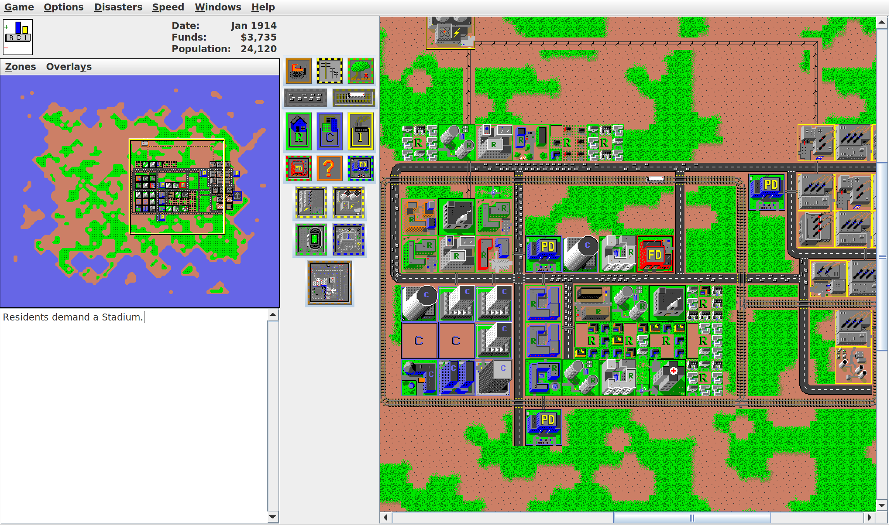
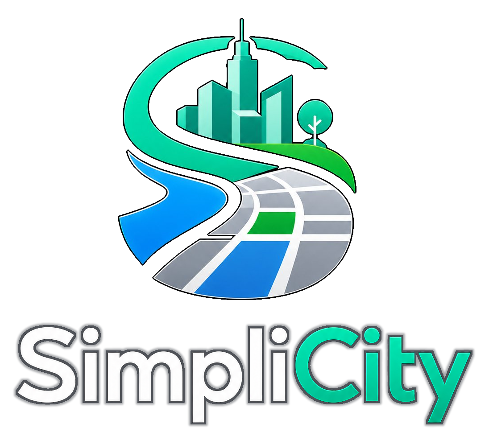

# SimpliCity

[_SimpliCity_](https://amagnolo.github.io/simplicity/) is a city simulation game rooted in the original SimCity, with small improvements and a focus on simplicity. It is an open source fork of [MicropolisJ](https://github.com/jason17055/micropolis-java), the Java/Swing port of [Micropolis](https://donhopkins.medium.com/open-sourcing-simcity-58470a275446), which in turn is the open source version of [SimCity](https://en.wikipedia.org/wiki/SimCity_(1989_video_game)#Micropolis).



You build a city, zone land for homes, commerce and industry, connect it with roads, rails and power, then manage taxes, services, traffic, pollution and growth. The game is intentionally closer to a quiet toy and simulation than to a modern always-engaging management game.

> [!TIP]
> If you just want to play the game, [visit the website](https://amagnolo.github.io/simplicity/). For technical details, keep reading. 

## About this project: purpose and goals

MicropolisJ was abandoned and needed renewal to keep running well on modern computers. SimpliCity keeps the classic simulation alive while modernizing the project around current Java and Maven tooling.

This fork aims to be:

- simple to run
- simple to play
- friendly by default, with easier gameplay settings enabled out of the box
- restrained, without adding addictive loops, mission pressure, milestone chasing or excessive visual complexity
- open to advanced features only when they can stay optional

The main audience is younger players first, then retro-game fans who want a small, understandable city simulator.

[Promo video](https://github.com/user-attachments/assets/3a7d19cc-2d9e-4920-a6d7-a16e656a3b36)

## Current changes

Compared with the original MicropolisJ codebase, SimpliCity currently includes:

- Maven build support
- Java 25 source and target level
- easier defaults, including automatic budget handling and disasters disabled by default
- graphics cleanup and reduced dithering
- Italian localization
- fixes and startup options for UI scaling and locale selection

See the [changelog](docs/changelog.adoc) for the project history.

## Requirements

- JDK 25
- Maven

## Build

```bash
mvn package
```

The build produces:

```text
target/SimpliCity-0.1.jar
```

## Run

```bash
java -jar target/SimpliCity-0.1.jar
```

The application is a desktop Java/Swing program.

## Documentation

- [Changelog](docs/changelog.adoc)
- [English player's guide](docs/simcity%20-%20player%27s%20guide.adoc)
- [Italian player's guide](docs/simcity%20-%20guida%20al%20gioco.adoc)
- [Historical MicropolisJ documentation](docs/legacy/README.adoc)

The player guides intentionally retain their original SimCity framing because they are adapted from the classic manual and document the rules of the game SimpliCity descends from.

## License and attribution

SimpliCity is a modified fork of MicropolisJ by Jason Long.

MicropolisJ is based on Micropolis, the Unix version developed by Don Hopkins for DUX Software under license from Maxis around 1990, later modified for the One Laptop Per Child program and released as free and open source software in 2008. The original game was designed and implemented by Will Wright. Portions are Copyright (C) 1989-2007 Electronic Arts Inc.; MicropolisJ is Copyright (C) 2013 Jason Long.

This project is free software under the GNU General Public License version 3 or later. See [COPYING](COPYING) for the GPLv3 text.

The original MicropolisJ README, preserved at [docs/legacy/MicropolisJ-README.txt](docs/legacy/MicropolisJ-README.txt), contains the original copyright notice and additional GPL section 7 terms, including the Electronic Arts trademark notice. SimpliCity is not affiliated with Electronic Arts, and this project does not grant any right to use the SimCity trademark or any other Electronic Arts trademark.

